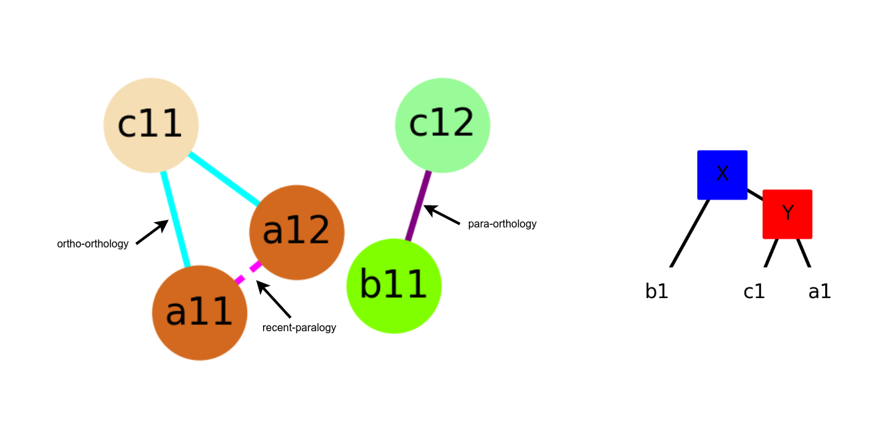
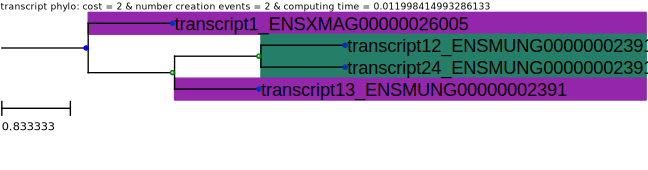
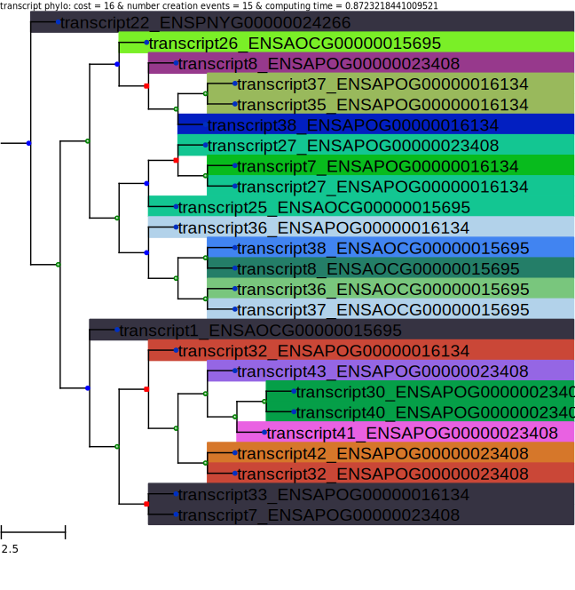

# :dna: Inferring Transcript Phylogenies from Clusters of Orthologous and Paralogous Transcripts :dna:

 

:busts_in_silhouette: __Authors__
* __Wend Yam Donald Davy Ouedraogo & Aida Ouangraoua__, CoBIUS LAB, Department of Computer Science, Faculty of Science, Université de Sherbrooke, Sherbrooke, Canada*

> :bulb: If you are using our algorithm in your research, please cite our recent paper: __Upcoming__ 

> :e-mail: __Contact: wend.yam.donald.davy.ouedraogo@usherbrooke.ca__

<!-- TABLE OF CONTENTS -->
<h2 id="table-of-contents"> :book: Table of Contents</h2>

  
<a href="#about-the-project">About the project</a>

    <ol>
    <a href="#overview"> ➤ Overview</a></ol>
    <ol>
    <a href="#requirements"> ➤ Requirements</a></ol>

  
<a href="#clustering">Inferring clusters of orthologous and paralogous transcripts</a>

  <ol>
    <li><a href="#package"> ➤ Package Pypi</a></li>
    <li><a href="#getting-started"> ➤ Getting Started</a></li>
    <li><a href="#project-files-description"> ➤ Project files descriptions </a>
    <ol>
    <a href="#project-files-description-inputs"> ➤ Inputs description</a>
    </ol>
    <ol><a href="#project-files-description-outputs"> ➤ Outputs description</a></ol>
    <ol><a href="#project-files-description-data"> ➤ Dataset</a></ol>
    </ol></li>
  </ol>

  
<a href="#phylogenies">Inferring Transcript Phylogenies</a>

  <ol>
    <li><a href="#package-2"> ➤ Package Pypi</a></li>
    <li><a href="#getting-started-2"> ➤ Getting Started</a></li>
    <li><a href="#project-files-description-2"> ➤ Project files descriptions </a>
    <ol>
    <a href="#project-files-description-inputs-2"> ➤ Inputs description</a>
    </ol>
    <ol><a href="#project-files-description-outputs-2"> ➤ Outputs description</a></ol>
    <ol><a href="#project-files-description-data-2"> ➤ Dataset</a></ol>
    </ol></li>
  </ol>

<!-- ABOUT THE PROJECT -->
<h1 id="about-the-project"> :pencil: About The Project</h1>

<!-- OVERVIEW -->
<h3 id="overview"> :cloud: Overview</h3>

`We present an algorithm for inferring clusters of orthologous and paralogous transcripts and a progressive supertree construction algorithm that employs a dynamic programming approach to infer transcript phylogenies based on the inferred clusters.`

---

<!-- Requirements -->
<h3 id="requirements"> :hammer_and_pick: Requirements</h3>

*   __`python3 (at leat python 3.6)`__
*   __`NetworkX`__
*   __`Pandas`__
*   __`Numpy`__
*   __`ETE toolkit`__
*   __`phylotreelib`__

<!-- ABOUT THE PROJECT -->
<h1 id="clustering"> Inferring clusters of orthologous and paralogous transcripts</h1>

<!-- Package -->
<h3 id="package"> :package: About the package</h3>

``install the package``
<pre><code>pip3 install transcriptorthology</code></pre>

``import package and use the main function``
<pre><code>from transcriptorthology.transcriptOrthology import inferring_transcripts_isoorthology

if __name__ == '__main__':
  gtot_path = './execution/mapping_gene_to_transcripts/ENSGT00390000000080.fasta'
  gt_path = './execution/NHX_trees/ENSGT00390000000080.nwk'
  lower_bound = 0.7
  transcripts_msa_path = './execution/transcripts_alignments/ENSGT00390000000080.alg'
  tsm_conditions = 2
  output_folder = './execution/output_folder'
  
  inferring_transcripts_isoorthology(transcripts_msa_path, gtot_path, gt_path, tsm_conditions, lower_bound, output_folder)</code></pre>

<!-- Getting started -->
<h2 id="getting-started"> :rocket: Getting Started</h2>

> Command

<pre><code>usage: transcriptOrthology.py [-h] [-talg TRALIGNMENT]
                              [-gtot GENETOTRANSCRIPTS] [-nhxt NHXGENETREE]
                              [-lowb LOWERBOUND] [-tsm TSMVALUE]
                              [-outf OUTPUTFOLDER]

program parameters

optional arguments:
  -h, --help            show this help message and exit
  -talg TRALIGNMENT, --tralignment TRALIGNMENT
                        Multiple Sequences Alignment of transcripts in FASTA
                        format
  -gtot GENETOTRANSCRIPTS, --genetotranscripts GENETOTRANSCRIPTS
                        mappings transcripts to corresponding genes
  -nhxt NHXGENETREE, --nhxgenetree NHXGENETREE
                        NHX gene tree
  -lowb LOWERBOUND, --lowerbound LOWERBOUND
                        a threshold for the selection of transcripts RBHs
  -tsm TSMVALUE, --tsmvalue TSMVALUE
                        an integer(1|2|3|4|5|6) that refers to the transcript
                        similarity measure
  -outf OUTPUTFOLDER, --outputfolder OUTPUTFOLDER
                        the output folder to store the results</code></pre>

`Details`

<table>
<tr>
    <th>parameter</th>
    <th>definition</th>
    <th>value format</th>
  </tr>
  <tr>
    <td>-talg --tralignment</td>
    <td>MSA of transcripts</td>
    <td>FASTA format   >{id_transcript}\n{sequence}</td>
  </tr>
  <tr>
    <td>-gtot  --genetotranscripts</td>
    <td>mappings g(t)</td>
    <td>FASTA format   >{id_transcript}:{id_gene}\n</td>
  </tr>
  <tr>
    <td>-nhxt  --nhxtgenetree</td>
    <td>gene tree</td>
    <td>NHX format</td>
  </tr>
  <tr>
    <td>-lowb  --lowerbound</td>
    <td>a lower bound to select RBHs transcripts. By default, equals to 0.5</td>
    <td>float between 0 and 1</td>
  </tr>
  <tr>
    <td>-tsm  --tsmvalue</td>
    <td>The similarity mesure(mean, length, unitary)</td>
    <td>integer 1(tsm+unitary) | 2(tsm+length) | 3(tsm+mean) | 4(tsm++unitary) | 5(tsm++length) | 6(tsm++mean)</td>
  </tr>
  <tr>
    <td>-outf   --outputfolder</td>
    <td>folder to save results. The current program folder is set by default.</td>
    <td>String</td>
  </tr>
</table>

> Usage example

<pre><code>python3 ./scripts/transcriptOrthology.py -talg ./execution/inputs/transcripts_alignments/ENSGT00390000000104.alg -gtot ./execution/inputs/mapping_gene_to_transcripts/ENSGT00390000000104.fasta -nhxt ./execution/inputs/NHX_trees/ENSGT00390000000104.nwk -lowb 0.7 -outf ./execution/outputs/ -tsm 1</code></pre>
OR
<pre><code>sh ./execution_inferring_clusters.sh</code></pre>

> Output expected

<pre><code>++++++++++++++++Starting ....
+++++++ All data were retrieved & the representation of subtranscribed sequences of genes into blocks are available.
+++++ Computing matrix ...       in progress
+++++ Computing matrix ...       status: Finished without errors in 0.42296433448791504 seconds
+++++ Searching for recent-paralogs ...         status: processing
+++++ Searching for recent-paralogs ...         status: finished in 0.11350250244140625 seconds
+++++ Searching for RBHs ...    status: processing
+++++ Searching for RBHs ...    status: finished in 0.09129834175109863 seconds
+++++ Construction of the orthology graph (Adding nodes ...) ...        status: processing
+++++ Construction of the orthology graph (Adding nodes ...) ...        status: finished in 0.524106502532959 seconds
+++++ Searching for connected components ...    status: processing
+++++ Searching for connected components ...    status: finished in 0.06076645851135254 seconds
++++++++++++++++Finished 
</code></pre>

<h2 id="project-files-description"> :file_folder: Project Files Description</h2>

<h3 id="project-files-description-inputs"> :keyboard: Inputs description </h3>

__Inputs files__
<ul>
    <li>:one:
    <em>tsmcomputing()</em> :arrow_right: returns the similarity matrix (tsm+ | tsm) scores depending on the `tsmvalue` for all pairs of homologous transcripts.
    <pre><code>usage: tsmComputing.py [-h] [-talg TRALIGNMENT]
                       [-gtot GENETOTRANSCRIPTS] [-tsm TSMVALUE]
                       [-outf OUTPUTFOLDER]

parsor program parameter

optional arguments:
  -h, --help            show this help message and exit
  -talg TRALIGNMENT, --tralignment TRALIGNMENT
  -gtot GENETOTRANSCRIPTS, --genetotranscripts GENETOTRANSCRIPTS
  -tsm TSMVALUE, --tsmvalue TSMVALUE
  -outf OUTPUTFOLDER, --outputfolder OUTPUTFOLDER</code></pre>
  </li>
    <li>:two:
    <em>Tclustering()</em> :arrow_right: returns the orthology graph of transcripts.
<pre><code>usage: Tclustering.py [-h] [-m MATRIX] [-gtot GENETOTRANSCRIPTS]
                      [-nhxt NHXGENETREE] [-lowb LOWERBOUND]
                      [-outf OUTPUTFOLDER]

parsor program parameter

optional arguments:
  -h, --help            show this help message and exit
  -m MATRIX, --matrix MATRIX
  -gtot GENETOTRANSCRIPTS, --genetotranscripts GENETOTRANSCRIPTS
  -nhxt NHXGENETREE, --nhxgenetree NHXGENETREE
  -lowb LOWERBOUND, --lowerbound LOWERBOUND
  -outf OUTPUTFOLDER, --outputfolder OUTPUTFOLDER </code></pre>
  </li>
  <li>:three:
    <em>transcriptOthology()</em> :arrow_right: returns for each pair of homologous transcripts, their homology relationship type (recent-paralogs, ortho-paralogs or ortho-orthologs).
  </li>
</ul>

--- 

<h3 id="project-files-description-outputs"> :minidisc: Outputs description </h3>

__Outputs files__

<ul>
    <li>:one: <b>matrix.csv</b> : similarity matrix score that present the tsm+ score between each pair of homologous transcripts.</li>
    <li>:two: <b>blocks_transcripts.csv|blocks_genes</b> : csv file describing the representation of blocks for each transcript(resp. gene).</li>
    <li>:three: <b>start_orthology_graph.pdf|end_orthology_graph.pdf</b> : orthology graph at the start of the algorithm(resp. at the end of the algorithm) showing only the pair relationships between recent-paralogs(resp. all the orthologous clusters). (:warning:only retrieved if the number of transcripts is not greater than 20)</li>
    <li>:four: <b>groupsOfOrthoogs.csv|relationsOrthology.csv</b> : csv files resuming the information of the isoorthology-clustering.</li>
</ul>

<h3 id="project-files-description-data"> :heavy_check_mark: Dataset </h3>

``The folder data contains dataset used for the studies and also the results obtained.``

 
---

<!-- ABOUT THE PROJECT -->
<h1 id="phylogenies"> Inferring phylogenies</h1>

<!-- Package -->
<h3 id="package"> :package: About the package</h3>

``Upcoming``

<!-- Getting started -->
<h2 id="getting-started-2"> :rocket: Getting Started</h2>

<h2 id="project-files-description-2"> :file_folder: Project Files Description</h2>

<h3 id="project-files-description-inputs-2"> :keyboard: Inputs description </h3>

<h3 id="project-files-description-outputs-2"> :minidisc: Outputs description </h3>

<h3 id="project-files-description-data-2"> :heavy_check_mark: Dataset </h3>

 
 
 
 
 
 
Copyright © 2023 CoBIUS LAB

